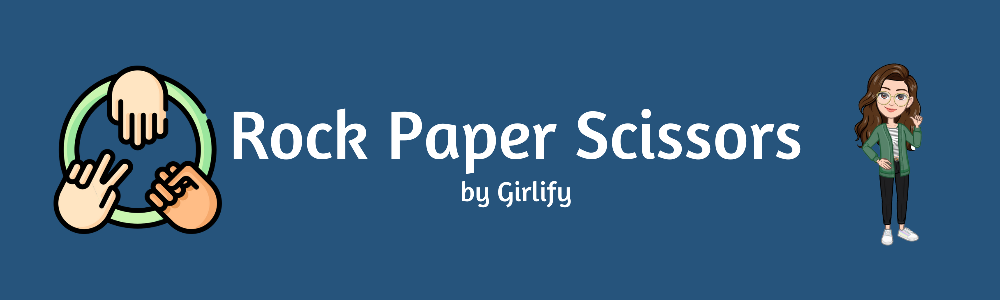
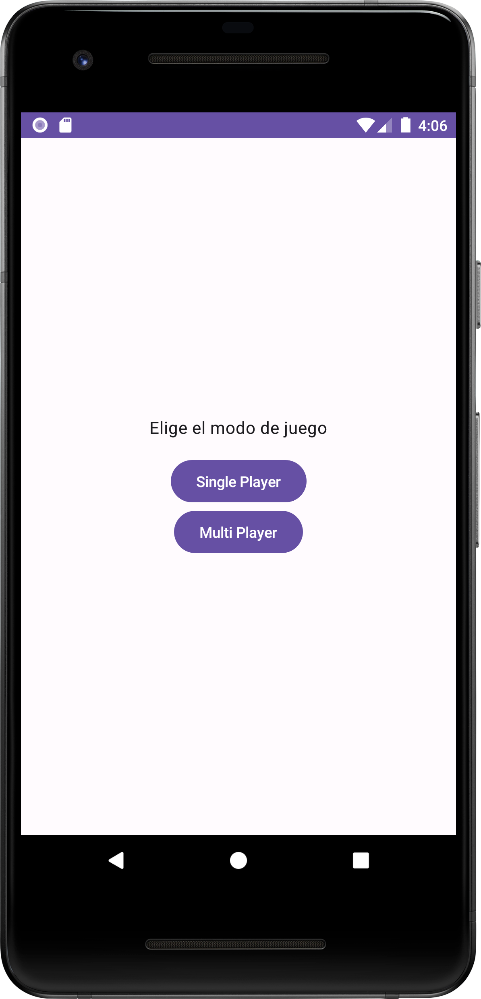
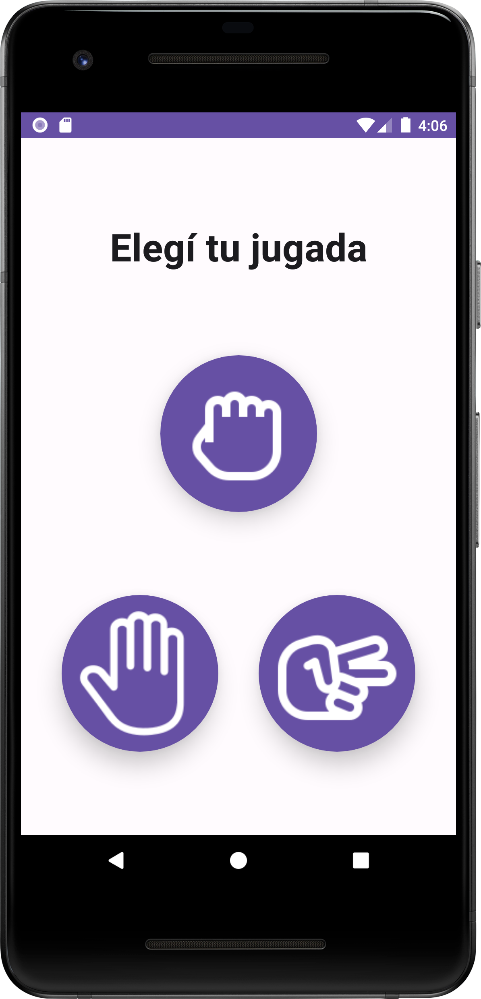
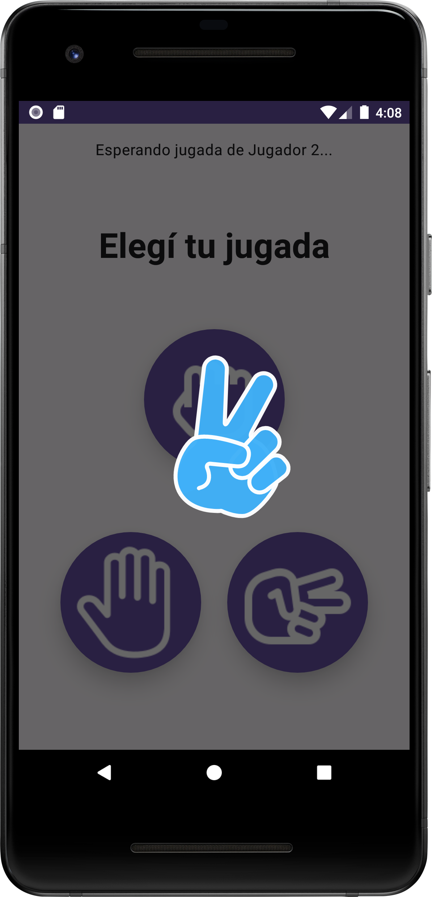
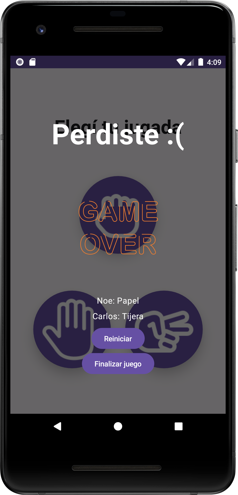

# ROCK-PAPER-SCISSORS 🚀

Juego de Piedra Papel o Tijera .

## Descripción

Esta es una aplicación de Android del clásico juego "Piedra Papel o Tijera", diseñada para brindar
una experiencia de juego divertida y emocionante para los usuarios. La aplicación permite a los
jugadores desafiar a sus amigos en partidas multijugador en tiempo real a través de la integración
con Firebase Realtime Database.

## Demo

### Single Player

### Multi Player

## Tecnologías utilizadas

- Jetpack Compose
- Clean Architecture
- MVVM
- Firebase Realtime
- Animaciones
- Inyeccion de Dependencias
- Corutinas
- Navigation

## Tabla de contenidos

- [Descripción](#descripción)
- [Demo](#demo)
- [Tecnologías utilizadas](#tecnologías-utilizadas)
- [Tabla de contenidos](#tabla-de-contenidos)
- [Instalación](#instalación)
- [Licencia](#licencia)
- [Footer](#footer)

## Instalación

[(Subir)](#tabla-de-contenidos)

Para instalar y ejecutar la aplicación, es necesario tener Android Studio instalado y seguir los
siguientes pasos:

1. Clonar el repositorio en tu máquina local.
2. Abrir el proyecto en Android Studio.
3. Ejecutar la aplicación en un dispositivo o emulador Android.

## Licencia

[(Subir)](#tabla-de-contenidos)

Este proyecto está bajo la Licencia MIT - ver el
archivo [LICENSE](https://github.com/honeybadger2788/RockPaperScissors/blob/dev/LICENSE) para más
detalles.

## Footer

[(Subir)](#tabla-de-contenidos)

Gracias por llegar hasta aqui! Si quieres hacerme alguna recomendacion o simplemente contactarte
conmigo, puedes hacerlo por cualquiera de estos medios:

- [CV online](https://myporfolio.notion.site/Noelia-Carosella-c0c2f1dbfc8d403e8660356546e90f75)
- [LinkedIn](https://www.linkedin.com/in/noeliabcarosella/)
- [Mail](mailto:noe.carosella@gmail.com)
